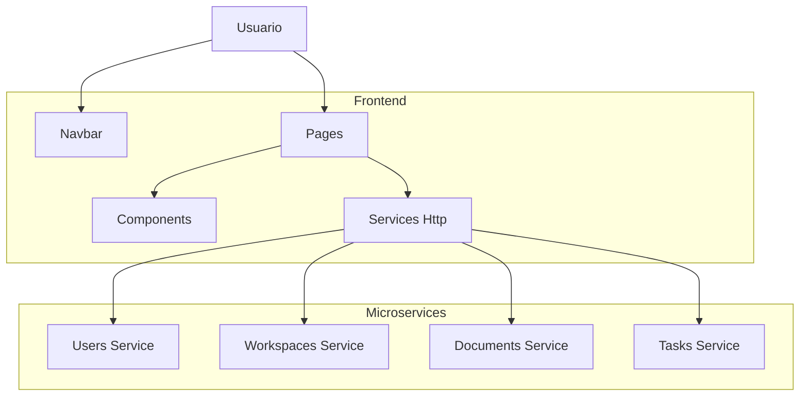

# Insightflow - Frontend

Frontend de la plataforma **Insightflow**

Este proyecto se centra en mostrar y gestionar la información de los usuarios y espacios de trabajo a través de la UI, comunicándose con los microservicios vía HTTP.

---

## Arquitectura y Patrón de Diseño

### Arquitectura: Microservicios

El frontend implementa:

- Arquitectura de capas (Layered Architecture)
- Comunicación **síncrona** mediante **HTTP**
- Gestión de rutas y páginas mediante **NextJS**



### Patrones de Diseño Implementados

1. **Component-Based Architecture:** Separación de UI en componentes reutilizables
2. **Service Layer:** Abstracción de llamadas HTTP a los microservicios
3. **Routing con NextJS:** Gestión de rutas y navegación.

## Tecnologías Utilizadas

- **Framework:** NextJS 16+
- **Contenedores:** Docker
- **Comunicación con microservicios:** HTTP
- **Versionado:** Git + Conventional Commits
- **CI/CD:** Github Actions

## Estructura del Proyecto

- **app/:** Páginas de la aplicación NextJS
- **lib/api:** Clases para llamadas a los microservicios
- **components/:** Componentes reutilizables de UI
- **models/:** Modelos TypeScript de los servicios

## Instalación y Configuración Local

### Requisitos previos

- **NodeJS 22 o superior**: [Download](https://nodejs.org/en)
- **pnpm**: npm install pnpm
- **Visual Studio Code**: [Download](https://code.visualstudio.com/)

### 1. Clonar el Repositorio

```bash
git clone https://github.com/InsightFlow-ORG/insigthflow-frontend.git

cd insigthflow-frontend
```

### 2. Establecer las variables de entorno

Crear un archivo llamado **.env**, y pegar el siguiente contenido:

```bash
NEXT_PUBLIC_API_URL=https://workspace-service-app-latest.onrender.com
NEXT_PUBLIC_USERS_API_URL=https://userservice-j6zz.onrender.com
Benjamin agregar URL
NEXT_PUBLIC_TASKS_API_URL=https://insightflow-tasks.onrender.com
```

### 3. Instalar Dependencias

```bash
pnpm install
```

### 4. Ejecutar el Proyecto

```bash
pnpm run dev
```

El servicio estará disponible en: http://localhost:3000

## Servicio desplegado

**Frontend**: https://insightflow-frontend-fd042.web.app/

